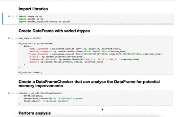

# pandas_dtype_efficiency

pandas_dtype_efficiency is a Python package to help reduce the memory size of pandas DataFrames without changing the 
underlying data (lossless compression). It is intended to make your code more efficient and reduce the likelihood of 
running out of memory.

This is achieved by checking every column to see whether it fits one of the following criteria:

* Float values where the user is comfortable with lower precision e.g. a numpy.float16 vs the pandas default of 
numpy.float64
* Integer values which can be represented by a smaller integer types e.g. values which fall between -128 and 127 can 
be accommodated with a numpy.int8
* String values which fall within a small list of set values and could be represented by the pandas.Categorical data 
type instead




## Installation

You will need [Python 3.7](https://www.python.org/downloads/) or higher, which comes with pip included in the 
installation.

The simplest method of installation is via pip:

```shell script
pip install pandas_dtype_efficiency
```

However, the package can also be installed directly from GitHub:

```shell script
# Option 1: HTTPS
pip install git+https://github.com/osulki01/pandas_dtype_efficiency#egg=pandas_dtype_efficiency

# Option 2: SSH
pip install git+ssh://github.com/osulki01/pandas_dtype_efficiency#egg=pandas_dtype_efficiency

# Option 3: HTTP, discouraged because HTTP is insecure due to lack of TLS based encryption
pip install git+http://github.com/osulki01/pandas_dtype_efficiency#egg=pandas_dtype_efficiency
```


## Example Usage


### Watch-outs


## Contributing

Any suggestions or contributions are welcome via emails or pull requests.


### Development environment
If you would like to experiment with the code or make changes, you can set up the development environment as per the 
steps below. In advance, you will need [Docker](https://docs.docker.com/get-docker/) and 
[Docker Compose](https://docs.docker.com/compose/install/) installed on your machine.

```shell script
# Build the Docker image (if running for the first time)
docker-compose build

# Create container
docker-compose up -d

# Run tests to make sure code is functional
docker exec pandas_dtype_efficiency_dev pytest --verbose tests/
```


## Meta

Distributed under the MIT License. See [LICENSE.txt](LICENSE.txt) for more information.
